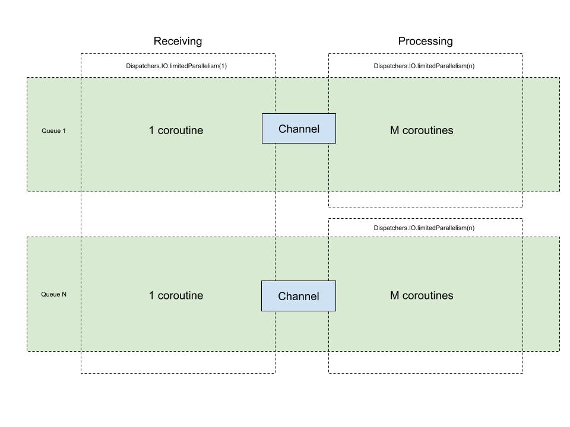

# Module: AWS SQS Module

**This module is still in experimental state. It's a work in progress towards:**
* supporting suspending handlers
* migration to AWS SDK v2

## Differences to the previous implementation

* uses AWS SDK v2
* exposes suspending API
* handlers return status and don't make calls to SQS. Acknowledging jobs is done by the framework code
* no dependency on the lease module. There will be at least one handler per service instance
* no dependency on the feature flags
* metrics are updated to v2, names of the metrics have been changed

## Migration

TODO - this section will have detailed steps for migrating from the previous implementation

## Threading model

Receiving and processing messages is handled by separate views on the `Dispatchers.IO`:
- querying SQS is done on a single thread
- for each subscribed queue, a receiving coroutine is created
- received jobs are sent to a dedicated per-queue channel with a default size of 0. This is configurable
- by default, there is a single thread with a single coroutine running dedicated to processing
  of jobs from a given queue. This is configurable as well.

How the configuration impacts the processing:
- increasing the channel size allows to pre-read jobs from SQS. This may be helpful to reduce the
  latency, but if the handler takes more time to process than the visibility timeout, it may lead
  to increased duplicated and out of order processing
- increasing the concurrency spins up more coroutines per queue. This may increase the throughput
  of processing, if processing mostly uses non-blocking operations
- increasing the parallelism will increase the thread pool size per-queue. Together with increased
  concurrency it may increase the throughput of processing, if processing involves heavy computations
  or blocking operations

It's advised to start with the default settings and adjust based on specific workloads.



## Configuration

You can define default configuration for all queue or choose to override it per queue.

Example YAML configuration:

```yaml
aws_sqs:
  all_queues:
    parallelism: 1
    concurrency: 5
    channel_capacity: 0
    wait_timeout: 20
    max_number_of_messages: 20
    install_retry_queue: true
  per_queue_overrides:
    ledger_validation_queue:
      parallelism: 5
      concurrency: 10
      channel_capacity: 5
    refund_delay_queue:
      concurrency: 5
```

You also need to add this configuration to your service configuration class, for example:

```kotlin
data class MiskSuspendingExemplarConfig(
  val skim: SkimServiceConfig,
  val aws_sqs: SqsConfig,
) : Config
```

## Outstanding todo items

The module will not be considered beta/GA state until the below items are completed.

Outstanding work that needs to be done:
* detailed test 
* tracing
* test fixtures
* external queues
* installing retry queue only on request
* detailed documentation

Things that are supported in the old documentation but are questionable:
* aws queue attribute importer

Outstanding things to document:
* how batch size plays out with channel size and visibility timeout